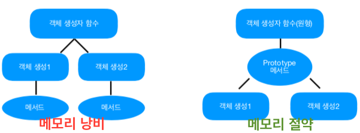

# __05. 함수__
## 함수
### 기본 함수 정의문
#### 일반 함수 정의
```js
function 함수명() {
    //code
}
```
#### 익명 함수 정의
```js
참조변수 = function() {
    //code
}
```
#### 두 방식의 차이점
```js
//일반 함수 정의 방식 (정상 작동)
testFunc();

function testFunc() {
    //code
}

//익명 함수 선언 참조 방식(오류 발생)
testFunc();

var testFunc = function() {
    //code
}
```
- 일반 함수 정의는 함수 호출 시 호이스팅 기술을 지원한다.
- 그러나 익명 함수 선언 참조 방식은 호이스팅을 지원하지 않는다.
- 호이스팅을 적용하면 함수 정의문보다 호출문이 먼저 나와도 함수 정의문을 끌어올려 함수를 호출한다.
## 함수 스코프 개념
### 함수 스코프란?
- 스코프(Scope)의 사전적인 의미는 '범위'이며, 여기에서는 변수 또는 함수의 유효범위를 가리킨다. 
- 스코프를 이해하기 위해서는 지역 변수(Local Variable)와 전역 변수(Global Variable)의 개념과 차이를 알아야한다.

### 전역 변수와 지역 변수의 개념과 차이
- 전역 변수는 자바스크립트 어디에서든 사용할 수 있는 변수
- 지역 변수는 함수 스코프에서만 사용할 수 있는 변수
```js
var score = 10;

function myFunc() {
    var score = 50;
    console.log(score); //50
}

myFunc();
console.log(score); //10
```

### 전역 함수와 지역 함수의 차이
- 전역 함수는 자바스크립트 어디에서든 사용할 수 있는 함수
- 지역 함수는 함수 스코프에서만 사용할 수 있는 함수
```js
function myFunc() {
    
}

function outerFunc() {
    function myFunc() {

    }
    myFunc(); //지역 함수 호출
}

outerFunc();
myFunc(); //전역 함수 호출
```

### 전역과 지역을 나누는 이유
```js
var num = 100;
function menu() { //개발자A
    num += 100;
    console.log(num);
}
menu();

function menu() { //개발자B
    console.log(num);
}
```
- 개발자A는 200이 출혁될 것을 예상했지만 개발자B가 만든 함수와 이름이 같아서 개발자A의 함수는 제거되고 100이 출력
- 프로젝트 규모가 커지고 여려 명의 개발자가 투입되면서 같은 이름의 전역 변수나 전역 함수를 사용하면 충돌이 발생
- 다른 개발자가 이미 개발해 놓은 라이브러리나 플러그인의 변수 또는 함수의 이름과 자신이 사용하는 변수나 함수의 이름이 같은 경우에도 충돌이 발생할 수 있다.
- 개발자A와 B가 지역 함수를 사용하여 함수를 선언했다면 함수가 충돌하는 문제를 피할 수 있었을 것이다.

### 즉시 실행 함수
즉시 실행 함수는 지역 함수 선언에 사용하면 효과적이다.

#### 기본형
```js
(function(){
    var 변수명; //지역 변수

    function 함수명() { //지역 함수
        //code
    }
}());
```

#### 즉시 실행 함수에 지역 변수와 지역 함수를 선언하여 충돌을 방지한 예제
```js
(function() {
    var num = 100;
    function menu() {
        num += 100;
        console.log(num);
    }
    menu();
}());

(function() {
    var num = 100;
    function menu() {
        console.log(num);
    }
}());
```

## 객체 생성자 함수의 활용
### 객체 생성자 함수
내장 객체를 생성할 때는 이미 자바스크립트 엔진에 내장되어 있는 객체 생성자 함수(Object Constructor Function)를 사용하여 객체를 생성한다. 이번에는 객체 생성자 함수를 선언하고 그 다음 객체를 생성해보겠다.

#### 객체 생성자 함수를 선언하고 객체를 생성하는 기본형
new 키워드를 사용해 객체를 생성하고 객체 생성자 함수에서 this 키워드를 사용해 생성한 객체에 속성과 함수를 등록한다.
```js
function 객체생성자함수명(매개변수1, 매개변수2, ...매개변수n) { // 객체 생성자 함수
    this.속성명 = 새 값;
    this.함수명 = function() {
        // 자바스크립트 코드
    }
}

var 참조변수(인스턴스 이름) = new 객체생성자함수명(); // 객체 생성

var 참조변수 = {
    속성: 새 값,
    함수명: function() {
        // ...
    }
}
```

#### 객체 생성자 함수를 선언하고 2개의 객체를 생성하는 예제
```js
function CheckWeight(name, height, weight) { // 객체 생성자의 함수명은 대문자로 시작하는 것이 관례
    this.userName = name;
    this.userHeight = height;
    this.userWeight = weight;
    this.minWeight;
    this.maxWeight;
    
    this.getInfo = function() {
        var str = "";
        str += "이름: " + this.userName + ", ";
        str += "키: " + this.userHeight + ", ";
        str += "몸무게: " + this.userWeight + "<br>";
        return str;
    }

    this.getResult = function() {
        this.minWeight = (this.userHeight - 100) * 0.9 - 5;
        this.maxWeight = (this.userHeight - 100) * 0.9 + 5;

        if(this.userWeight >= this.minWeight) {
            return "정상 몸무게 입니다";
        } else if(this.userWeight < this.minWeight) {
            return "정상 몸무게보다 미달입니다";
        } else {
            return "정상 몸무게보다 초과입니다";
        }
    }
}

var jang = new CheckWeight("장보리", 168, 62);
var park = new CheckWeight("박달재", 180, 88);
console.log(jang);
console.log(park);

document.write(jang.getInfo());
document.write(jang.getResult());
```

### 메모리 절약을 위한 프로토타입 사용하기

#### 프로토타입의 필요성
위 예제와 같이 객체를 생성하게 되면 객체를 생성한 만큼 함수가 등록된다. 그리고 함수를 여러개 등록하면 메모리 공간을 많이 차지하여 메모리를 낭비하게 된다. 이런 경우에 객체 생성자 함수에 프로토타입(Prototype)을 사용하여 함수를 등록하면 메모리 낭비를 줄일 수 있다.

#### 프로토타입의 의미

프로토타입(Prototype)의 사전적 의미는 '원형'이다. 자바스크립트에서 '원형'은 객체 생성자 함수를 의미한다. 프로토타입을 사용하여 등록한 함수는 원형(객체 생성자 함수)에서 생성된 객체를 공유할 수 있다. 즉, 여러개의 함수를 등록할 필요가 없고 결론적으로 메모리 절약이 가능하다.

#### 프로토타입으로 객체를 생성할 때 함수를 등록하는 기본형
```js
function 함수명(매개변수1, 매개변수2, ... 매개변수n) {
    this.속성명 = 새 값;
}

객체생성자함수명.prototype.함수명 = function() {
    // 자바스크립트 코드
}

var 참조변수(인스턴스 이름) = new 객체생성자함수명();
```

#### 객체를 생성할 때 프로토타입으로 함수를 등록하는 예제
```js
function CheckWeight(name, height, weight) { // 객체 생성자의 함수명은 대문자로 시작하는 것이 관례
    this.userName = name;
    this.userHeight = height;
    this.userWeight = weight;
    this.minWeight;
    this.maxWeight;
}

CheckWeight.prototype.getInfo = function() {
    var str = "";
    str += "이름: " + this.userName + ", ";
    str += "키: " + this.userHeight + ", ";
    str += "몸무게: " + this.userWeight + "<br>";
    return str;
}

CheckWeight.prototype.getResult = function() {
    this.minWeight = (this.userHeight - 100) * 0.9 - 5;
    this.maxWeight = (this.userHeight - 100) * 0.9 + 5;

    if(this.userWeight >= this.minWeight) {
        return "정상 몸무게 입니다";
    } else if(this.userWeight < this.minWeight) {
        return "정상 몸무게보다 미달입니다";
    } else {
        return "정상 몸무게보다 초과입니다";
    }
}

var jang = new CheckWeight("장보리", 168, 62);
var park = new CheckWeight("박달재", 180, 88);
console.log(jang);
console.log(park);

document.write(jang.getInfo());
document.write(jang.getResult());

document.write(jang.getReault === park.getResult);
// 해당 값이 true라는 것은 둗 객체가 같은 함수를 사용하고 있다는 의미 

```